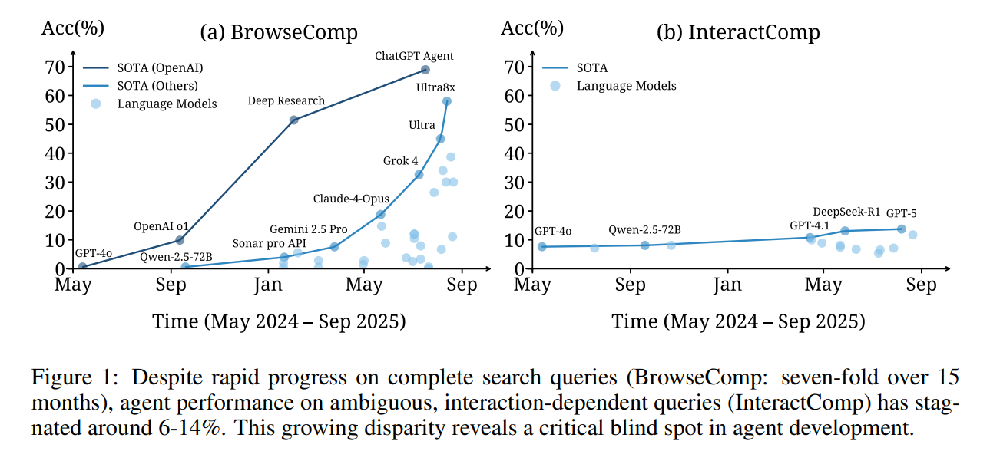
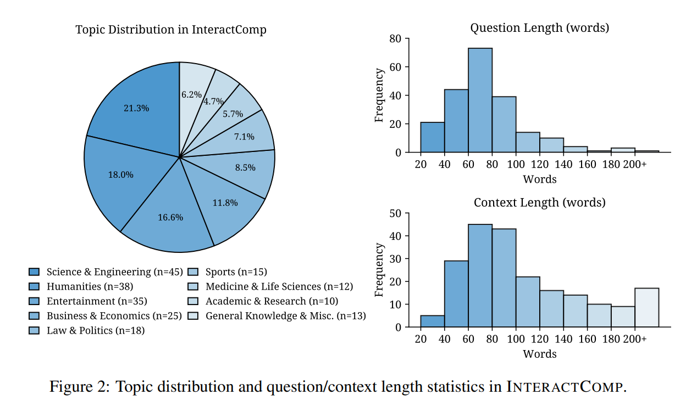

# InteractComp
[](https://arxiv.org/abs/2510.24668)

This is a framework for evaluating InteractComp benchmark about how large language models handle interactive reasoning tasks. It ships with a reusable ReAct-style agent, pluggable search and clarification actions, and an asynchronous evaluation pipeline.



## Highlights
- **Multi-action agents**: built-in `answer`, `search`, and `ask` actions support answer-only, search-only, full, full-with-context, and forced-ask interaction modes.
- **Async evaluation loop**: `asyncio`-based orchestration lets you benchmark multiple candidate models concurrently while tracking accuracy, token usage, and action counts.
- **Simulated user responses**: the Responder component reads task-specific context and produces `yes` / `no` / `i don't know` answers to mimic user feedback during clarification rounds.
- **Extensible engine**: model backends, search providers, and logging are abstracted behind simple interfaces, making it straightforward to plug in custom services.

<p align="center">
  
  <br>
</p>

## Repository Layout

```
core/                 # Agent, actions, prompts, search helpers, logging utilities
config/               # Experiment and infrastructure configuration templates
data/                 # Datasets and evaluation outputs
run_benchmark.py      # Main entry point for launching evaluations
```

## Getting Started

### 1. Prerequisites
1. Install Python 3.10 or newer.
2. Set up dependencies inside a virtual environment:

   ```bash
   pip install openai aiohttp aiofiles pandas tqdm pydantic tenacity pyyaml
   ```

### 2. Configure Models and Services
- Edit `config/infra_config.yaml` to add model credentials (`api_key`, `base_url`, temperature, and so on).  
  When an LLM name is requested, the loader checks `config/global_config.yaml`, and `config/infra_config.yaml` in that order, so feel free to define model entries in any of those files.
- To enable web search, provide a [Serper.dev](https://serper.dev/) key in `search.engines.google.api_key`. Leave it empty if you plan to disable search actions.

### 3. Configure the Experiment
Adjust `config/exp_config.yaml` to describe your evaluation plan:

```yaml
llms:
  user_llm: "gpt-4o-mini"      # model used by the Responder (ask action)
  test_llm:
    - "gpt-4o-mini"            # list of target models to benchmark
  temperature: 0.6
  top_p: 0.95

experiment_setting:
  max_rounds: 10               # maximum agent steps per task
  max_concurrency: 10          # concurrent task evaluations
  mode: "full"                 # full | search_only | answer_only | full_with_context | forced_ask
  enforce_ask_min: 5           # minimum asks when mode == forced_ask

file_paths:
  data_path: "data/dataset/InteractComp210.jsonl"
  result_folder_path: "data/results"
```

### 4. Prepare the Dataset
- Tasks are stored as JSONL, one JSON object per line with fields such as `id`, `question`, `answer`, and `context`. Example placeholder (values may be obfuscated in sample distributions):

  ```json
  {"id": 101, "question": "Who proposed the InteractComp benchmark?", "answer": "Foundation Agents", "context": "..."}
  ```

- The Responder retrieves `context` by `id` to generate deterministic clarifications. Ensure the dataset path in `file_paths.data_path` matches the actual file you intend to use.

### 5. Run the Benchmark

```bash
python run_benchmark.py --config config/exp_config.yaml
```

Outputs are written to `result_folder_path/<timestamp>/<model_name>/`:
- Per-task CSV logs with question, prediction, confidence, interaction history, score, token cost, and action counts.
- `models_summary.csv` and `models_summary.json` aggregating average score, average cost, and total cost for each evaluated model.
- `log.json` capturing grading mismatches and extraction issues for post-hoc review.

## Contributing & License
- Contributions via issues or pull requests are welcome.
- Unless otherwise noted, follow the license distributed with this repository.

## Citing InteractComp
If you build upon InteractComp, please cite our work:

```bibtex
@misc{deng2025interactcomp,
  title         = {InteractComp: Evaluating Search Agents With Ambiguous Queries},
  author        = {Mingyi Deng and Lijun Huang and Yani Fan and Jiayi Zhang and others},
  year          = {2025},
  eprint        = {2510.24668},
  archivePrefix = {arXiv},
  primaryClass  = {cs.CL},
  url           = {https://arxiv.org/abs/2510.24668}
}
```
